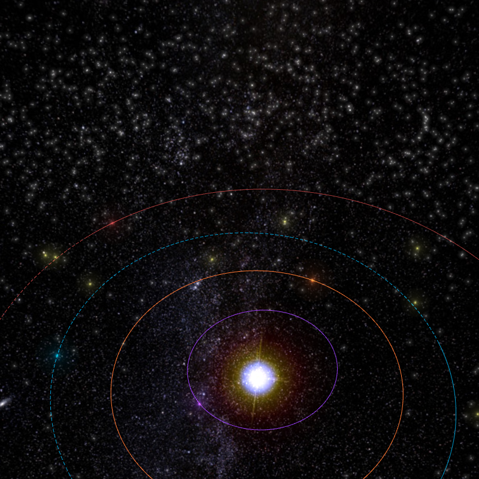

# Introduction

Asteroids are minor planets, especially those of the inner Solar System. The larger ones have also been called planetoids. These terms have historically been applied to any astronomical object orbiting the Sun that did not show the disc of a planet and was not observed to have the characteristics of an active comet. As minor planets in the outer Solar System were discovered and found to have volatile-based surfaces that resemble those of comets, they were often distinguished from asteroids of the asteroid belt

# About the project

[Asterank](http://www.asterank.com) is a scientific and economic database of over 600,000 asteroids. This database is created and maintained by Ian Webster.

They've collected, computed, or inferred important data such as asteroid mass and composition from multiple scientific sources. With this information, we estimate the costs and rewards of mining asteroids.

Asterank applies accurate, up-to-date information from world markets and scientific papers. To ensure realistic estimates, data from meteorites on Earth and known reference asteroids heavily influence their calculations.

# How I can help

Asterank has compiled hundreds of thousands of sky survey images taken by publicly funded observatories. To discover an asteroid, watch the animation of the night sky and look for a moving white dot. There's a good chance that moving dot is an asteroid. The first user to notice the dot gets potential discovery credit and naming rights.

**[Discover an asteroid](http://www.asterank.com/discover)**

Asterank is an open-source project (MIT license) and its code is available [on Github](http://www.asterank.com/discover). So if you are a developer, then you can contribute to the project and help with issues or additional features.

**[Fork, change and create a pull request](https://github.com/typpo/asterank)**

# Useful links

[Ian Webster -- the author of Asterank](http://ianww.com/)

[Minor Planet Center](http://minorplanetcenter.org/iau/mpc.html)

[JPL Small-Body Database](http://ssd.jpl.nasa.gov/sbdb.cgi#top)

## Credits

[Asterank site](http://www.asterank.com/about)

[Wikipedia](https://en.wikipedia.org/wiki/Asteroid)
