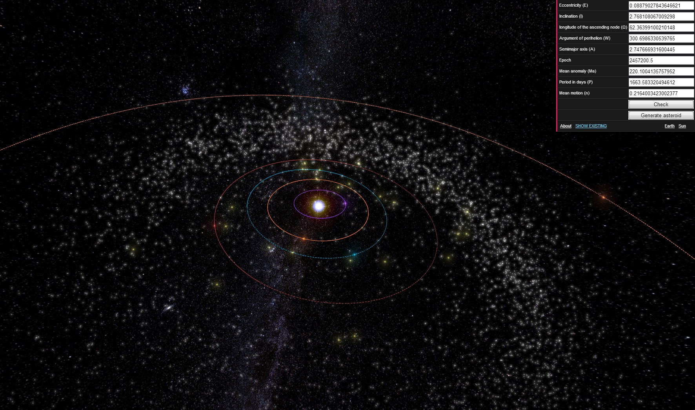
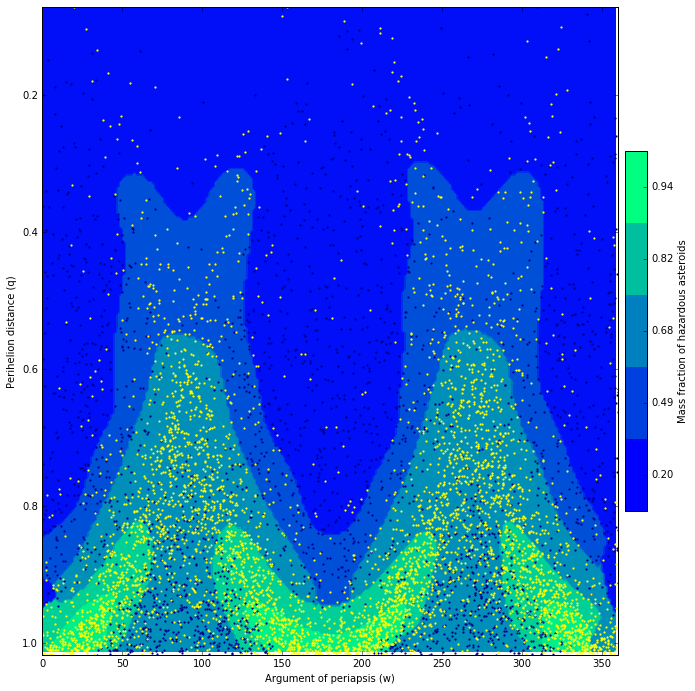

[//]: # (This is an example of comment line)
[//]: # (Use Markdown https://guides.github.com/features/mastering-markdown/)

## Introduction

Millions of asteroids orbit the Sun in the main belt between Mars and Jupiter. Some of them have been nudged by the gravitational attraction of nearby planets into orbits that allow them to enter the Earth's neighborhood. These asteroids are defined as Near Earth Asteroids. Those of NEAs, whose Earth Minimum Orbit Intersection Distance (MOID) is smaller than 0.05 AU can pose a threat to our home planet (depending on their size) and are known as Potentially Hazardous Asteroids. Due to several astronomical surveys, the number of known PHAs has increased tenfold since the end of the 1990s. But yet only less than 30% of NEAs have been discovered and fewer than 5% have well-characterized spectra.

## About the project

Asterion – CYA is a double project that was initiated at NASA Space Apps Challenge global hackathon in May 2016 and became a global finalist by nomination “Best use of data”. Project aims two goals:

- Characterize orbital parameters of yet undiscovered PHAs using machine learning and computer simulations. Such knowledge can facilitate development of future asteroid-hunting missions by providing information on orbits with high probability of undiscovered PHAs existence.
- Increase global awareness of asteroid impact threat and provide tools to investigate and analyze PHAs.

Asterion is an is an open-source (MIT license) Python library for asteroid database mining and its code is available on Github.
CYA (short of Check Your Asteroid) – is an open-source web application, based on the original code of Asterank. It enables users to check MOID for known and unknown (or newly discovered) asteroids and visualize their orbits in 3D space.

Currently project is on the very early stage of development and new features will come soon.

## How I can participate

Discover new asteroids and check if they are potentially hazardous at CYA website. If you really find new PHA make a feedback to Minor Planet Center.

#### Contribute Code

Fork [Asterion on GitHub](https://github.com/nomad-vagabond/asterion) and suggest new algorithms for PHA classification.

#### Contribute feedback

e-mail: [keenon3d@gmail.com](mailto:keenon3d@gmail.com?subject=Asterion%20Feedback%20from%Spacer)

## Useful links

[Asterion-CYA at NASA Space Apps Challenge](https://2016.spaceappschallenge.org/challenges/solar-system/near-earth-objects-machine-learning/projects/asterion-cya)

[Asterion source code at GitHub](https://github.com/nomad-vagabond/asterion)

[CYA source code at GitHub](https://github.com/nasa2016kr/cya)

[CYA website](http://nasa2016kr.pythonanywhere.com/)

### Credits

Ian Webster – developer of Asterank
