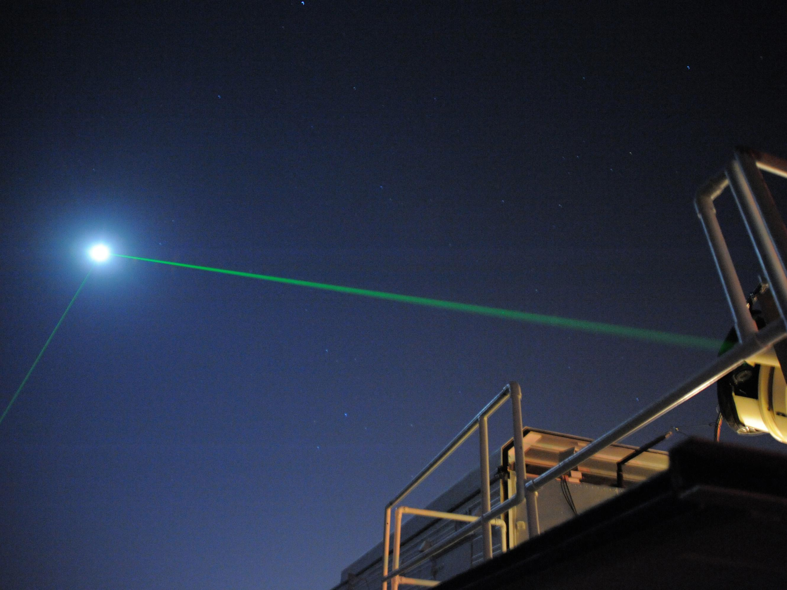

## About the project

Laser correction system is a project that aims to provide an orbital service to CubeSat owners. We offer to maintain CubeSat on the target orbit and withdraw it into the dense layers of the atmosphere upon the lifetime expiration by using the medium-power laser (10 kW) in combination with a high precision ground-based telescope. The system we are offering uses impulse transmission of photons from the solid-state fiber laser for CubeSat orbit correction, simulating operating principle of a solar sail. Using photons pressure as a mean of change of the orbit eliminates the possibility of the laser system to accidentally damage the satellite or to be perceived as a weapon.

According to preliminary calculations, if one affects the space objects that are in orbit up to 800 km altitude and are passing directly above the station which uses a solid-state laser and an optical system with a diameter of 1.5 m, the displacement of the objects would be 2.5 kilometers per day. Such short pulses can be transmitted only by photon burst transmission.

The first stage of working on our system involves launching a CubeSat 2U covered with special reflective plates to LEO and integrating a telescope with a solid state laser. At this stage it is planned to determine the rates of acceleration upon exposure of the laser system and CubeSat surface temperature indicators upon exposure of different powered lasers (from 1 to 10 kW).

## How I can participate

If you are interested in our project you can help us by contributing to the project by means of development software and hardware.

#### Software Development

The project could benefit a lot from your participation in its Open Source software development.

#### Hardware Development

We need assistance in the acquisition of CubeSat equipment as well as laser and optical systems.

#### Telemetry Acquisition

Once CubeSat is launched it would require your help in tracking telemetry of the satellite and reporting it back. More info will follow soon.

## Useful links

[Website](https://spacer.im/projects/)

[Spacer Slack](https://spacer-slack.herokuapp.com/)
