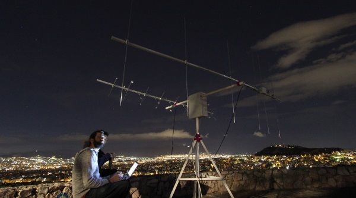

# About the project

SatNOGS is a Satellite Networked Open Ground Station. It’s a network of satellite ground stations focused on observing and receiving the signal of satellites, particularly low earth orbit (LEO) CubeSats.

SatNOGS started in mid-April 2014, during the NASA Space App Challenge hackathon in hackerspace.gr based in Athens, Greece.

SatNOGS provides a scalable and modular platform to communicate with them.
Low Earth Orbit (LEO) satellites are our priority and for a good reason. Hundreds of interesting projects worth of tracking and listening are happening in LEO and SatNOGS provides a robust platform for doing so.

They support VHF and UHF bands for the reception with the default configuration, which is easily extendable for transmission and other bands too.

# How I can help

They like Open Source practices in both software and hardware. You can help them by contributing to the project, making it better one commit at the time.

**[Project repositories on Github](https://github.com/satnogs)**

If you are willing to connect your rotator to the SatNOGS network it is recommended to have access to an ADSL or a 3G data connection, for uploading the data back to the network.

# Additional links

[SatNOGS Community](https://community.satnogs.org/)

[About the team](https://satnogs.org/team/)

[SatNOGS Twitter](https://twitter.com/satnogs)

## Credits

[SatNOGS website](https://satnogs.org)
