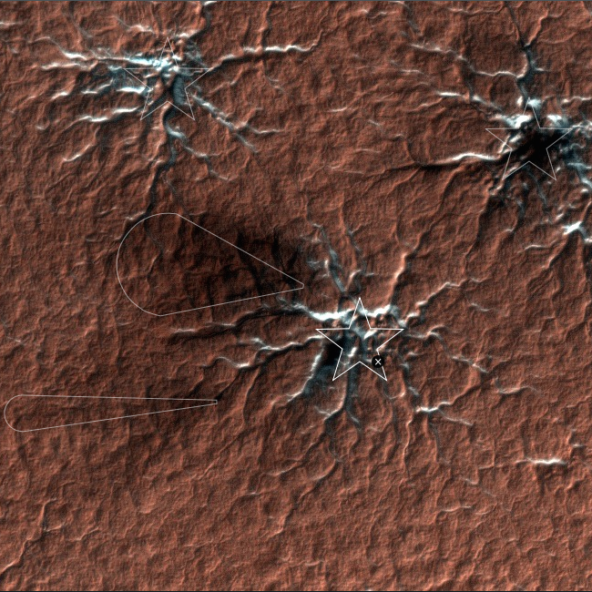

# Introduction

[Mars Reconnaissance Orbiter (MRO)](http://mars.jpl.nasa.gov/mro/) is a multipurpose spacecraft designed to conduct reconnaissance and exploration of Mars from orbit. The US$720 million spacecraft was built by Lockheed Martin under the supervision of the Jet Propulsion Laboratory. The mission is managed by the California Institute of Technology, at the JPL, in La Cañada Flintridge, California, for the NASA Science Mission Directorate, Washington, D.C. It was launched August 12, 2005, and attained Martian orbit on March 10, 2006. In November 2006, after five months of aerobraking, it entered its final science orbit and began its primary science phase.

NASA's Mars Reconnaissance Orbiter is on a search for evidence that water persisted on the surface of Mars for a long period of time. While other Mars missions have shown that water flowed across the surface in Mars' history, it remains a mystery whether water was ever around long enough to provide a habitat for life.

# About the project

[Planet Four](http://www.planetfour.org/) is a citizen science project designed to help planetary scientists identify and measure features on the surface of Mars. All of the images on this site depict the southern polar region, an area of Mars that we know little about, and the majority of which have never been seen by human eyes before!

The images on this site come from the HiRISE (High Resolution Imaging Science Experiment) camera on board the Mars Reconnaissance Orbiter. HiRISE can image Mars with resolutions of 0.3 m/pixel (about 1 foot), resolving objects below a meter across.

# How I can help

Scientists need your help to find and mark ‘fans’ and ‘blotches’ on the Martian surface. Scientists believe that these features indicate wind direction and speed. By tracking ‘fans’ and ‘blotches’ over the course of several Martian years to see how they form, evolve, disappear and reform, we can help planetary scientists better understand Mars’ climate. The team also hopes to find out if these features form in the same spot each year and also learn how they change.

Your markings will be collected together with the markings made by other volunteers on that same image. Taking an average of these markings, scientists will produce an extremely reliable map of the ‘fan,’ and ‘blotch’ features on the surface of Mars and the first large scale measurement of wind on the planet!

**[Start Classify](http://www.planetfour.org/#/classify)**

# Useful links

[Planet FOUR: the science team](http://www.planetfour.org/#/about/scientists)

[Planet FOUR: the development team](http://www.planetfour.org/#/about/developers)

[Classification Examples](http://www.planetfour.org/#/about/examples)

[MRO images](http://mars.jpl.nasa.gov/mro/multimedia/images/)

## Credits

[Planet FOUR](http://www.planetfour.org/)

[Wikipedia](https://en.wikipedia.org/wiki/Mars_Reconnaissance_Orbiter)

[NASA JPL](http://mars.jpl.nasa.gov/mro/)
